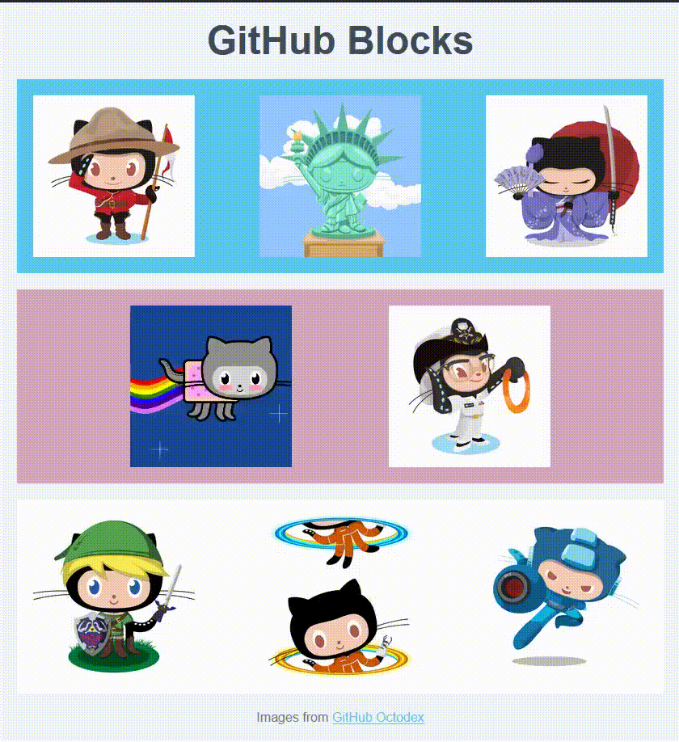

# GitHub Blocks Assignment

## Objectives
- Practice using the **Box Model** properties: `padding`, `border`, and `margin`.
- Develop familiarity with **Flexbox** properties.
- Practice using different values of `justify-content`.
- Use **margin** and **padding** to adjust spaces between rows and apply **Flexbox** properties to arrange images as shown in the provided layout.
- Set images to a uniform size.



## Assignment Instructions

1. **Set Up**: Download 8 images from the [Octodex](https://octodex.github.com/), GitHub's collection of Octocat images.
2. **Image Styling**:
    - Use the following CSS rule to set a uniform height for each image:
      ```css
      img.octocat {
          height: 200px;
      }
      ```
3. **Layout**:
    - Using Flexbox, arrange the images to match the layout shown in the assignment.
    - Apply `justify-content` values as needed to align the images within each row.
    - Use `margin` and `padding` to adjust spacing between rows and ensure a cohesive layout.
4. **Customize**:
    - Choose your favorite colors and images from the Octodex to personalize your layout.


## Submission Checklist

1. Ensure your layout closely matches the reference image.
2. Verify that all images are uniformly sized and positioned correctly using Flexbox.
3. Upload the code and images to the assignment platform.

### Technologies Used
- HTML - For structuring the page.
- CSS - For styling the text elements as per the assignment.
