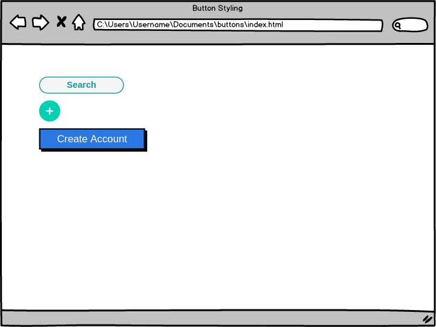

# Button Up Assignment

## Objectives
In this assignment, you will practice your CSS skills by recreating various button styles using the properties you’ve learned so far. Specifically, you will work with the following CSS properties:
- **Border and Border-Radius**
- **Height and Width**
- **Optional:** Explore using the [box-shadow](https://developer.mozilla.org/en-US/docs/Web/CSS/box-shadow) CSS property

## Assignment Overview
Your task is to recreate the look of several button elements as shown in the reference image below:



### Buttons to Recreate
1. **Search Button**: Create a button that resembles a search button commonly seen on websites.
2. **Plus Button**: Design a circular button (using `border-radius: 50%`) that represents the "+" icon.
3. **Create Account Button**: Style a button that encourages users to create an account.

### Optional Enhancement
- **Box-Shadow**: For the "Create Account" button, experiment with the `box-shadow` property to add depth and dimension. This will enhance the visual appeal of the button.

## CSS Properties to Focus On
Here are some key properties you may find useful for your buttons:

- **Border**: Define the border style, width, and color.
- **Border-Radius**: Control the roundness of the button corners. Use `border-radius: 50%;` for circular buttons.
- **Height and Width**: Set the dimensions of the buttons according to your design.
- **Box-Shadow**: Add shadows to create a layered effect. Example:
  ```css
  box-shadow: 0 4px 8px rgba(0, 0, 0, 0.2);

## Requirements
- Recreate the look of the "Search Button"
- Recreate the look of the "+" button, border-radius: 50%; may be useful for making a circle
- Recreate the look of the "Create Account" button
- (Optional) Try applying box-shadow to the "Create Account" button

## Technologies Used
- HTML - For structuring the page.
- CSS - For styling the text elements as per the assignment.
