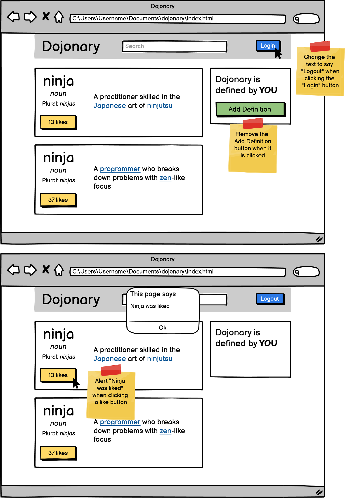

# Button Clicker Assignment

## Overview

This project is designed to practice using the `onclick` event in JavaScript to interact with elements on a webpage. You’ll combine HTML, CSS, and JavaScript to create a layout based on the provided wireframe and implement specific button-click functionalities.

## Objectives

The main objectives of this assignment are:
1. **Event Handling** - Use the `onclick` event in JavaScript to make interactive changes on the page.
2. **HTML and CSS Layout** - Recreate the layout as shown in the wireframe.
3. **JavaScript Functionalities**:
   - Change the "logout" text to "login" when clicked.
   - Remove the "Add definition" button when clicked.
   - Display an alert saying "Ninja was liked" when clicking the like button.

- Practice using the onclick event
- Combine what we've learned of HTML, CSS and JS

### Recreate the layout you see below. It may be helpful to focus on getting the HTML and CSS completed before adding the JS functionality to the page.

## Completion Checklist
1. - Confirm that clicking the "logout" button toggles it to "login" and vice versa.
2. - Check that clicking "Add definition" removes the button from the page.
3. - Verify that clicking the "Like" button triggers an alert with the message "Ninja was liked."

## Requirements
- Visually recreate the wireframe as shown above
- Change "logout" text to say "login" on click
- Remove the "Add definition" button when clicked
- Alert "Ninja was liked" when clicking a like button

## Technologies Used
- HTML - Structure of the layout.
- CSS - Styling to match the wireframe.
- JavaScript - Functions for button interactivity. 
