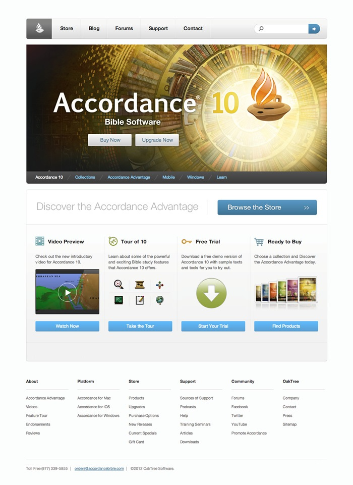

# Web Fundamentals Belt Exam - Accordance Page

## Overview

This project is part of the Web Fundamentals Belt Exam. The goal is to recreate the layout and styling of the Accordance software page shown in the reference image, using HTML and CSS.

The project tests your knowledge and skills in:
- Structuring a webpage with HTML.
- Styling elements with CSS, including layout, typography, and responsive design.
- Creating a clean, user-friendly layout with navigation, call-to-action buttons, and footer links.

## Project Requirements

1. **Navigation Bar**: 
   - Create a navigation bar at the top with links for "Store," "Blog," "Forums," "Support," and "Contact."
   - Include a search icon on the right side of the navigation bar.

2. **Main Banner Section**:
   - Add a main banner section with the Accordance logo, the title "Accordance Bible Software," and the version number (10).
   - Include two main buttons for "Buy Now" and "Upgrade Now."

3. **Secondary Navigation**:
   - Below the main banner, add a secondary navigation bar with links like "Accordance 10," "Collections," "Accordance Advantage," "Mobile," "Windows," and "Learn."

4. **Feature Highlights Section**:
   - Create a section titled "Discover the Accordance Advantage" with a button labeled "Browse the Store."
   - Include four feature blocks:
     - **Video Preview**: A block with a video thumbnail and button labeled "Watch Now."
     - **Tour of 10**: A block with icons and a button labeled "Take the Tour."
     - **Free Trial**: A block with a download icon and button labeled "Start Your Trial."
     - **Ready to Buy**: A block with product images and a button labeled "Find Products."

5. **Footer**:
   - Create a footer with sections for "About," "Platform," "Store," "Support," "Community," and "OakTree."
   - Add links for various subpages under each footer category.
   - Include contact information and copyright details at the bottom.

## Getting Started

1. **Create the Project Folder**:
   - Create a folder named `accordance-page` (or any preferred name) for your project files.
   
2. **Create HTML and CSS Files**:
   - Inside the folder, create an `index.html` file for the HTML structure.
   - Create a `styles.css` file for styling.

3. **Link CSS to HTML**:
   - In your `index.html` file, link the `styles.css` file to apply styling.

## Styling Tips

1. **Font and Colors**:
   - Use CSS to style the text, with appropriate font sizes and colors for each section. Use subtle background colors where needed, such as in buttons and the footer.
   
2. **Buttons**:
   - Style buttons consistently with padding, background color, and hover effects.
   
3. **Layout**:
   - Use CSS flexbox or grid to align elements in each section, especially for the main navigation bar, secondary navigation, and feature blocks.

4. **Responsive Design**:
   - Ensure the page looks good on both desktop and mobile devices by using media queries.

## Completion Checklist
- The navigation bar is correctly structured and styled.
-  The main banner section includes all required elements and styling.
-  The secondary navigation bar is in place and styled.
- Feature highlights section is completed with four feature blocks.
- Footer is structured with appropriate sections, links, and contact details.
- The page is responsive on different screen sizes.

## Technologies Used
- HTML - For the structure of the webpage.
- CSS - For styling the elements to match the design.